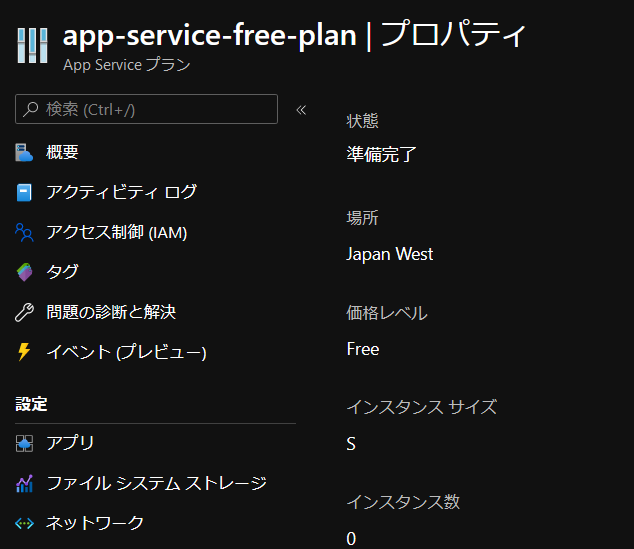

# App Service Plan

:link: [App Service プラン - Azure App Service | Microsoft Docs](https://docs.microsoft.com/ja-jp/azure/app-service/overview-hosting-plans)  

## Azure CLI

:link: [az appservice plan | Microsoft Docs](https://docs.microsoft.com/ja-jp/cli/azure/appservice/plan)  
:link: [az appservice plan # create | Microsoft Docs](https://docs.microsoft.com/ja-jp/cli/azure/appservice/plan#az-appservice-plan-create)  

``az appservice plan create`` :   

``--name`` : 作成する App Service Plan 名。  
``--resource-group`` : 既存のリソースグループを指定。  
``--sku`` :  価格レベル。   
　F1(Free), D1(Shared), B1(Basic Small), B2(Basic Medium) …   
``--location`` : 作成先のリージョン。  

```bash
$ az appservice plan create \
> --name app-service-free-plan \
> --resource-group *****-********-****-****-****-************ \
> --sku FREE \
> --location japanwest
{- Finished ..
  "freeOfferExpirationTime": null,
  "geoRegion": "Japan West",
  "hostingEnvironmentProfile": null,
  "hyperV": false,
  "id": "/subscriptions/********-****-****-****-************/resourceGroups/*****-********-****-****-****-************/providers/Microsoft.Web/serverfarms/app-service-free-plan",
  "isSpot": false,
  "isXenon": false,
  "kind": "app",
  "location": "Japan West",
  "maximumElasticWorkerCount": 1,
  "maximumNumberOfWorkers": 1,
  "name": "app-service-free-plan",
  "numberOfSites": 0,
  "perSiteScaling": false,
  "provisioningState": "Succeeded",
  "reserved": false,
  "resourceGroup": "*****-********-****-****-****-************",
  "sku": {
    "capabilities": null,
    "capacity": 0,
    "family": "F",
    "locations": null,
    "name": "F1",
    "size": "F1",
    "skuCapacity": null,
    "tier": "Free"
  },
  "spotExpirationTime": null,
  "status": "Ready",
  "subscription": "********-****-****-****-************",
  "tags": null,
  "targetWorkerCount": 0,
  "targetWorkerSizeId": 0,
  "type": "Microsoft.Web/serverfarms",
  "workerTierName": null
}
```


  


## Azure PowerShell

:link: [New-AzAppServicePlan (Az.Websites) | Microsoft Docs](https://docs.microsoft.com/ja-jp/powershell/module/az.websites/new-azappserviceplan)  


``New-AzAppServicePlan`` :   

``-Name`` : 作成する App Service Plan 名。  
``-ResourceGroupName`` : 既存のリソースグループを指定。  
``-Tier`` :  価格レベル。   
　Free, Shared, Basic Small, Basic Medium …   
``-Location`` : 作成先のリージョン。  


```powershell
PS > New-AzAppServicePlan `
>>   -Name app-service-free-plan `
>>   -ResourceGroupName *****-********-****-****-****-************ `
>>   -Tier Free `
>>   -Location japanwest


AdminSiteName             :
WorkerTierName            :
Status                    : Ready
Subscription              : ********-****-****-****-************
HostingEnvironmentProfile :
MaximumNumberOfWorkers    : 1
GeoRegion                 : Japan West
PerSiteScaling            : False
MaximumElasticWorkerCount :
NumberOfSites             : 0
IsSpot                    : False
SpotExpirationTime        :
FreeOfferExpirationTime   :
ResourceGroup             : *****-********-****-****-****-************
Reserved                  : False
IsXenon                   : False
HyperV                    :
TargetWorkerCount         : 0
TargetWorkerSizeId        : 0
ProvisioningState         : Succeeded
Sku                       : Microsoft.Azure.Management.WebSites.Models.SkuDescription
Id                        : /subscriptions/********-****-****-****-************/resourceGroups/learn-a0a166f9-e59a
                            -48bc-90d1-9b7f4b4b4dda/providers/Microsoft.Web/serverfarms/app-service-free-plan
Name                      : app-service-free-plan
Kind                      : app
Location                  : Japan West
Type                      : Microsoft.Web/serverfarms
Tags                      :
```
　  
　  
　  
　  
　  
　  

* * *

###### :copyright: 商標について

<sup>当ドキュメントに記載されている会社名、システム名、製品名は一般に各社の登録商標または商標です。</sup>  
<sup>なお、本文および図表中では、「™」、「®」は明記しておりません。</sup>  

###### 免責事項  
<sup>当ドキュメント上の掲載内容については細心の注意を払っていますが、その情報に関する信頼性、正確性、完全性について保証するものではありません。</sup>  
<sup>掲載された内容の誤り、および掲載された情報に基づいて行われたことによって生じた直接的、また間接的トラブル、損失、損害については、筆者は一切の責任を負いません。</sup>  
<sup>また当ドキュメント、およびドキュメントに含まれる情報、コンテンツは、通知なしに随時変更されます。</sup>  