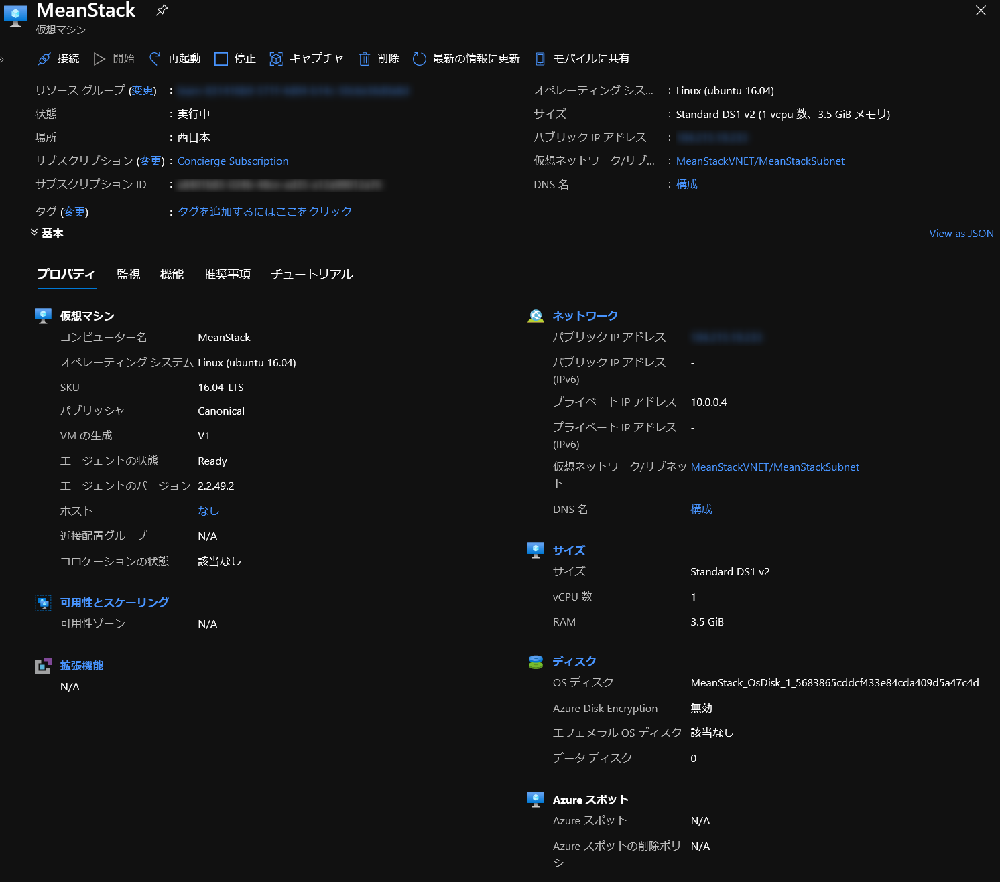
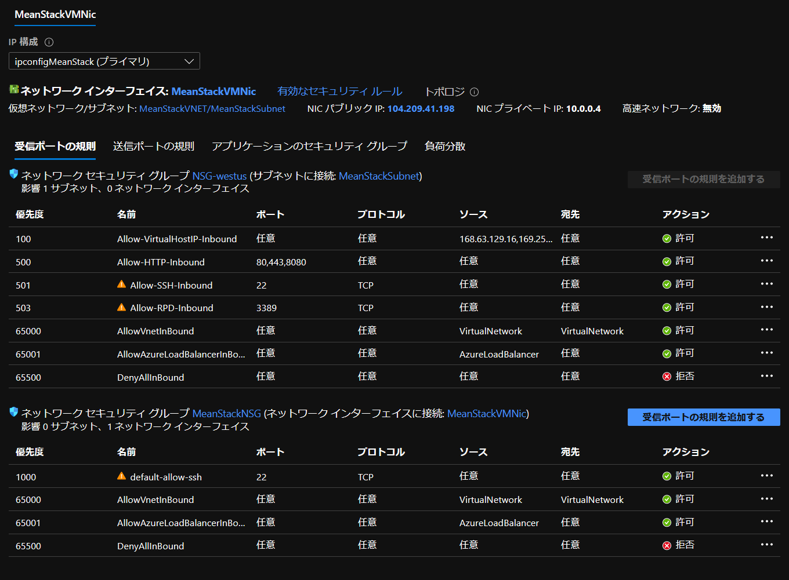
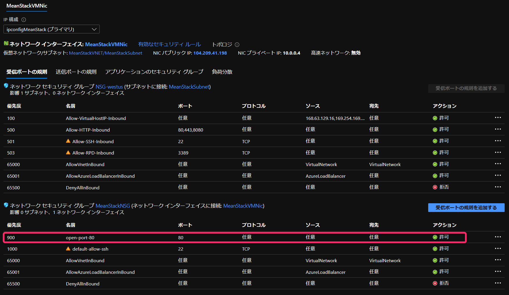
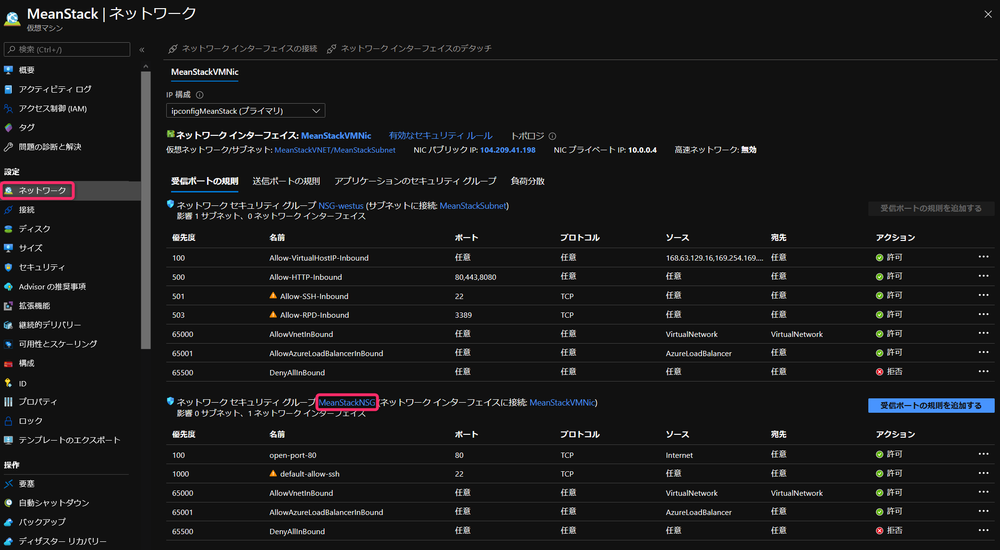
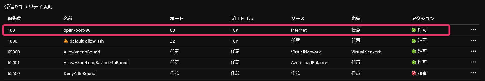

# VM

Azure 仮想マシンへの操作。  

| No. | Type                           | 1. Azure CLI              | 2. Azure PowerShell  
| --: | ------------------------------ | ------------------------- | -----------------------  
| 1   | VM の作成                      | az vm create              | New-AzVM
| 2   | VM の確認                      | az vm show                | Get-AzVM
| 3   | ``NSG`` ポートオープン          | az vm open-port           | Set-AzNetworkSecurityGroup

　  

``NSG`` : ネットワーク セキュリティ グループ  

:link: [Azure ネットワーク セキュリティ グループの概要 | Microsoft Docs](https://docs.microsoft.com/ja-jp/azure/virtual-network/security-overview)  
:link: [Azure ネットワーク セキュリティ グループを作成、変更、削除する | Microsoft Docs](https://docs.microsoft.com/ja-jp/azure/virtual-network/manage-network-security-group)  


---

## 1. Azure CLI

:link: [az vm | Microsoft Docs](https://docs.microsoft.com/ja-jp/cli/azure/vm)  

### 1.1 az vm create

:link: [az vm # create | Microsoft Docs](https://docs.microsoft.com/ja-jp/cli/azure/vm#az-vm-create)  
:link: [クイック スタート - Azure CLI を使用して Windows VM を作成する - Azure Windows Virtual Machines | Microsoft Docs](https://docs.microsoft.com/ja-jp/azure/virtual-machines/windows/quick-create-cli)  


``az vm create``: 

``引数の種類が多いので最低限必要な項目のみ``  
``VM サイズ、作成先のリージョンは適宜指定してください。``  
``--resource-group`` : 既存のリソースグループを指定。  
``--name`` : 作成する VM 名。  
``--image`` : 使用する VM イメージ（利用できるイメージの一覧は ``az vm image list`` で確認できます。）  
``--admin-username`` : 管理者権限のユーザ名。  
``--generate-ssh-keys`` : SSH 公開鍵ファイルを作成（当コマンドを実行した環境に作成されます）。  

```bash
az vm create \
  --resource-group *****-********-****-****-****-************ \
  --name MeanStack \
  --image Canonical:UbuntuServer:16.04-LTS:latest \
  --admin-username azureuser \
  --generate-ssh-keys
{
  "fqdns": "",
  "id": "/subscriptions/********-****-****-****-************/resourceGroups/*****-********-****-****-****-************/providers/Microsoft.Compute/virtualMachines/MeanStack",
  "location": "japanwest",
  "macAddress": "00-22-48-EE-F8-E4",
  "powerState": "VM running",
  "privateIpAddress": "10.0.0.4",
  "publicIpAddress": "***.***.**.***",
  "resourceGroup": "*****-********-****-****-****-************",
  "zones": ""
}
```

  

SSH 接続する場合は パブリック IP アドレスに ``--admin-username`` で指定した管理者ユーザで接続できます。

``ssh azureuser@***.***.**.***`` :   

```bash
$ ssh azureuser@***.***.**.***
Welcome to Ubuntu 16.04.7 LTS (GNU/Linux 4.15.0-1092-azure x86_64)

 * Documentation:  https://help.ubuntu.com
 * Management:     https://landscape.canonical.com
 * Support:        https://ubuntu.com/advantage

# ~ 省略

azureuser@MeanStack:~$
```

### 1.2 az vm show

:link: [az vm # show | Microsoft Docs](https://docs.microsoft.com/ja-jp/cli/azure/vm#az-vm-show)  

``az vm show`` :   

``--resource-group`` : 既存のリソースグループを指定。  
``--name `` : 対象の VM 名。  

```bash
$ az vm show \
>   --resource-group *****-********-****-****-****-************ \
>   --name MeanStack
{
  "additionalCapabilities": null,
  "availabilitySet": null,
  "billingProfile": null,
  "diagnosticsProfile": null,
  "evictionPolicy": null,
  "extensionsTimeBudget": null,
  "hardwareProfile": {
    "vmSize": "Standard_DS1_v2"
  },
  "host": null,
  "hostGroup": null,

# ~ 省略

```

応用として引数 ``--query`` を指定することによって出力内容を加工できます。  
詳しくは [Query command results with Azure CLI | Microsoft Docs](https://docs.microsoft.com/en-us/cli/azure/query-azure-cli) を参照してください。  

サンプルとして対象 VM のパブリック IP アドレスを取得したい場合は次のように指定します。  

```bash
$ az vm show \
>   --resource-group *****-********-****-****-****-************ \
>   --name MeanStack \
>   --show-details \
>   --query [publicIps] \
>   -o tsv
***.**.*.***
```

パブリック IP アドレスのみ出力されます。  


### 1.3 az vm open-port

:link: [az vm # open-port | Microsoft Docs](https://docs.microsoft.com/ja-jp/cli/azure/vm#az-vm-open-port)  
:link: [Azure CLI を使用して VM へのポートを開く - Azure Linux Virtual Machines | Microsoft Docs](https://docs.microsoft.com/ja-jp/azure/virtual-machines/linux/nsg-quickstart)  

``az vm open-port`` :   

``--resource-group`` : 既存のリソースグループを指定。  
``--name`` : 対象の VM 名。  
``--port`` : 開くポート番号。  

```bash
$ az vm open-port \
>   --port 80 \
>   --resource-group *****-********-****-****-****-************ \
>   --name MeanStack
{
  "defaultSecurityRules": [
    {
      "access": "Allow",
      "description": "Allow inbound traffic from all VMs in VNET",
      "destinationAddressPrefix": "VirtualNetwork",
      "destinationAddressPrefixes": [],
      "destinationApplicationSecurityGroups": null,
      "destinationPortRange": "*",
      "destinationPortRanges": [],
      "direction": "Inbound",
      "etag": "W/\"281b5fe5-6251-4685-a99e-23eae6c77430\"",
      "id": "/subscriptions/********-****-****-****-************/resourceGroups/*****-********-****-****-****-************/providers/Microsoft.Network/networkSecurityGroups/MeanStackNSG/defaultSecurityRules/AllowVnetInBound",
      "name": "AllowVnetInBound",

# ~ 省略
```

変更前：  
  


変更後：  
  


---

## 2. Azure PowerShell

:link: [Az.Compute Module | Microsoft Docs](https://docs.microsoft.com/ja-jp/powershell/module/az.compute/#virtual-machines)  

### 2.1 New-AzVM

:link: [New-AzVM (Az.Compute) | Microsoft Docs](https://docs.microsoft.com/ja-jp/powershell/module/az.compute/new-azvm)  
:link: [Azure 仮想マシンの PowerShell のサンプル - Azure Windows Virtual Machines | Microsoft Docs](https://docs.microsoft.com/ja-jp/azure/virtual-machines/windows/powershell-samples)  

``New-AzVM`` :  

``引数の種類が多いので最低限必要な項目のみ``  
``VM サイズ、作成先のリージョンは適宜指定してください。``  
``-ResourceGroupName`` : 既存のリソースグループを指定。   
``-Name`` : 作成する VM 名。  
``-Image`` : 使用する VM イメージ、利用できるイメージは [Azure Marketplace イメージを検索して使用する - Azure Windows Virtual Machines | Microsoft Docs](https://docs.microsoft.com/ja-jp/azure/virtual-machines/windows/cli-ps-findimage) を参照してください。  
``-Credential`` :  (Get-Credential) 作成するユーザ名、パスワードをダイアログから入力。  
  パブリック IP アドレス から SSH 接続する場合、 Get-Credential はセキュリティ上推奨されませんので、必要に応じて SSH キーを作成してください。  
  [Quickstart - Create a Linux VM with Azure PowerShell - Azure Linux Virtual Machines | Microsoft Docs](https://docs_microsoft_com.it.overbrowser.com/nb-no/azure/virtual-machines/linux/quick-create-powershell#create-ssh-key-pair)  

```powershell
PS > New-AzVM `
  -ResourceGroupName *****-********-****-****-****-************ `
  -Name MeanStack `
  -Image Canonical:UbuntuServer:16.04-LTS:latest `
  -Credential (Get-Credential)

コマンド パイプライン位置 1 のコマンドレット Get-Credential
次のパラメーターに値を指定してください:
Credential

ResourceGroupName        : *****-********-****-****-****-************
Id                       : /subscriptions/********-****-****-****-************/resourceGroups/*****-********-****-****-****-************/providers/Microsoft.Compute/virtualMachines/MeanStack
VmId                     : 16535f1d-4e8e-448b-b486-f30dc1c492a8
Name                     : MeanStack
Type                     : Microsoft.Compute/virtualMachines
Location                 : westus
Tags                     : {}
HardwareProfile          : {VmSize}
NetworkProfile           : {NetworkInterfaces}
OSProfile                : {ComputerName, AdminUsername, LinuxConfiguration, Secrets, AllowExtensionOperations, Re
quireGuestProvisionSignal}
ProvisioningState        : Succeeded
StorageProfile           : {ImageReference, OsDisk, DataDisks}
FullyQualifiedDomainName : meanstack-******.westus.cloudapp.azure.com
```

### 2.2 Get-AzVM

:link: [Get-AzVM (Az.Compute) | Microsoft Docs](https://docs.microsoft.com/en-us/powershell/module/az.compute/get-azvm)  


``Get-AzVM`` :  
``-ResourceGroupName`` : 既存のリソースグループを指定。  
``-Name`` : 対象の VM 名。  

```powershell
PS > Get-AzVM `
>>   -ResourceGroupName *****-********-****-****-****-************ `
>>   -Name MeanStack


ResourceGroupName : *****-********-****-****-****-************
Id                : /subscriptions/********-****-****-****-************/resourceGroups/*****-********-****-****-****-************
e7-254448cbde2c/providers/Microsoft.Compute/virtualMachines/MeanStack
VmId              : f0abdbd2-769c-4e95-b7e4-c2ff573347b7
Name              : MeanStack
Type              : Microsoft.Compute/virtualMachines
Location          : westus
Tags              : {}
Extensions        : {DependencyAgent, MMAExtension}
HardwareProfile   : {VmSize}
NetworkProfile    : {NetworkInterfaces}
OSProfile         : {ComputerName, AdminUsername, LinuxConfiguration, Secrets, AllowExtensionOperations, RequireGu
estProvisionSignal}
ProvisioningState : Succeeded
StorageProfile    : {ImageReference, OsDisk, DataDisks}
```

### 2.3 Set-AzNetworkSecurityGroup

``Set-AzNetworkSecurityGroup`` のみではポートオープンは出来ません、複数のコマンドを実行して実現できます。  
VM の利用しているのセキュリティーグループに対してポートオープンします。  

手順：  
1. ``Get-AzNetworkSecurityGroup`` で対象のセキュリティグループを取得(PowerShell の変数に代入)する。  
2. ``Add-AzNetworkSecurityRuleConfig`` でセキュリティールールを作成する(PowerShell の変数に再代入)。  
3. ``Set-AzNetworkSecurityGroup`` でセキュリティーグループに適用する（手順 1. 2. の変数を適用する）。  

:link: [Get-AzNetworkSecurityGroup (Az.Network) | Microsoft Docs](https://docs.microsoft.com/ja-jp/powershell/module/az.network/get-aznetworksecuritygroup)  
:link: [Add-AzNetworkSecurityRuleConfig (Az.Network) | Microsoft Docs](https://docs.microsoft.com/ja-jp/powershell/module/az.network/add-aznetworksecurityruleconfig)  
:link: [Set-AzNetworkSecurityGroup (Az.Network) | Microsoft Docs](https://docs.microsoft.com/ja-jp/powershell/module/az.network/set-aznetworksecuritygroup)  

　  

補足：Azure Portal でセキュリティグループの辿り方   
  


1:   

``Get-AzNetworkSecurityGroup`` :  

``-ResourceGroupName`` : 既存のリソースグループを指定。  
``-Name`` : 対象の NSG 名（VM 名ではありません）。  

```powershell
PS > $nsgObject = Get-AzNetworkSecurityGroup `
>>   -Name "MeanStackNSG" `
>>   -ResourceGroupName "*****-********-****-****-****-************"
```

``$nsgObject`` 変数に代入しています。  


2:   

``Add-AzNetworkSecurityRuleConfig`` :  

``-NetworkSecurityGroup`` : 対象のネットワークセキュリティーグループを指定、1: Get-AzNetworkSecurityGroup で格納した変数を指定してください。  
``-Direction`` : 送信（Inbound）セキュリティ規則または送信（Outbound）セキュリティ規則を指定。  
``-SourceAddressPrefix`` :  ソース IP アドレス / CIDR 範囲 を指定します。  
``-SourcePortRange`` : ソースポート範囲を指定。  
``-DestinationAddressPrefix`` : 宛先を指定。  
``-DestinationPortRange`` : 宛先ポート範囲を指定。  
``-Priority`` : 優先度を指定。  
``-Access`` : このルールについて許可（Allow）または拒否（Deny）を指定。  
``-Name`` : 作成するセキュリティ規則の名前を指定。  

```powershell
PS > $nsgObject = Add-AzNetworkSecurityRuleConfig `
>> -NetworkSecurityGroup $nsgObject `
>> -Direction Inbound `
>> -SourceAddressPrefix Internet `
>> -SourcePortRange * `
>> -DestinationAddressPrefix * `
>> -DestinationPortRange 80 `
>> -Priority 100 `
>> -Protocol Tcp `
>> -Access Allow `
>> -Name open-port-80
```
  
受信セキュリティ規則を TCP ポート 80 番を全て許可して名前を open-port-80 とします。    
変数は再代入します。  

3:  

``Set-AzNetworkSecurityGroup`` :  

``-NetworkSecurityGroup`` : 対象のネットワークセキュリティーグループを指定、2: Add-AzNetworkSecurityRuleConfig で格納した変数を指定してください。  


```powershell
PS > Set-AzNetworkSecurityGroup -NetworkSecurityGroup $nsgObject


Name                 : MeanStackNSG
ResourceGroupName    : *****-********-****-****-****-************
Location             : westus
Id                   : /subscriptions/********-****-****-****-************/resourceGroups/*****-********-****-****-****-************/providers/Microsoft.Network/networkSecurityGroups/MeanStackNSG
Etag                 : W/"7f1e5fc2-3904-46a3-b3f4-8175932fb7d8"
ResourceGuid         : 2e5ea4a1-db56-433f-8aff-6ac5e1364b8e
ProvisioningState    : Succeeded

# 省略
```

ProvisioningState に Succeeded が表示されていれば正常に適用されています。  

  
　  
　  
　  
　  
　  
　  

* * *

###### :copyright: 商標について

<sup>当ドキュメントに記載されている会社名、システム名、製品名は一般に各社の登録商標または商標です。</sup>  
<sup>なお、本文および図表中では、「™」、「®」は明記しておりません。</sup>  

###### 免責事項  
<sup>当ドキュメント上の掲載内容については細心の注意を払っていますが、その情報に関する信頼性、正確性、完全性について保証するものではありません。</sup>  
<sup>掲載された内容の誤り、および掲載された情報に基づいて行われたことによって生じた直接的、また間接的トラブル、損失、損害については、筆者は一切の責任を負いません。</sup>  
<sup>また当ドキュメント、およびドキュメントに含まれる情報、コンテンツは、通知なしに随時変更されます。</sup>  